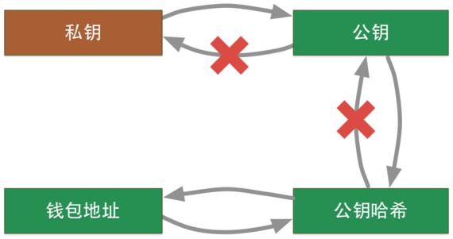
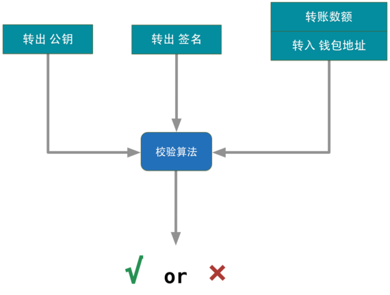
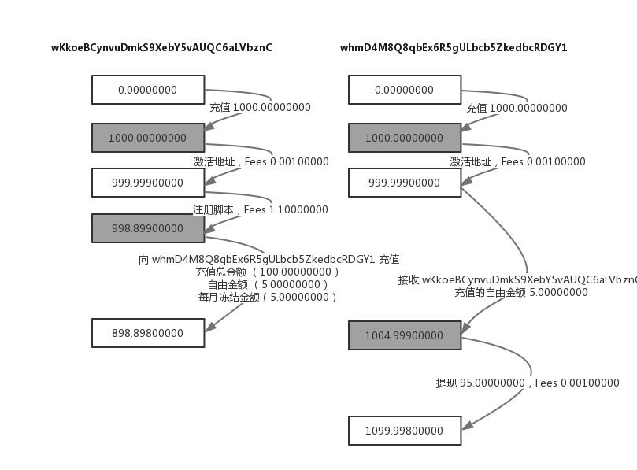

[TOC]

------

> **参考资料：**
>
> - [比特币白皮书中英文对照版](http://www.ehcoo.com/A%20Peer-to-Peer%20Electronic%20Cash%20System.html)
> - [精通比特币](http://zhibimo.com/read/wang-miao/mastering-bitcoin/index.html)
> - [区块链技术指南](http://book.8btc.com/blockchain_guide)
> - [区块链维基百科](https://en.wikipedia.org/wiki/Blockchain)
> - [深度解析挖矿的逻辑和技术实现](https://blog.csdn.net/taifei/article/details/72895903)
> - [stratum 协议原理](http://www.8btc.com/stratum_protocol)
> - [图灵完备维基百科](https://en.wikipedia.org/wiki/Turing_completeness)
> - [币科技](https://www.bikeji.com)

## 比特币 bitcoin

### 比特币测试网络

1. 查看版本

```bash
kevin@ubuntu:~$ cat /etc/issue
Ubuntu 14.04.5 LTS \n \l
kevin@ubuntu:/usr/local/bin$ bitcoind -version
Bitcoin Core Daemon version v0.16.99.0-7c32b41
Copyright (C) 2009-2018 The Bitcoin Core developers

Please contribute if you find Bitcoin Core useful. Visit
<https://bitcoincore.org> for further information about the software.
The source code is available from <https://github.com/bitcoin/bitcoin>.

This is experimental software.
Distributed under the MIT software license, see the accompanying file COPYING
or <https://opensource.org/licenses/MIT>

This product includes software developed by the OpenSSL Project for use in the
OpenSSL Toolkit <https://www.openssl.org> and cryptographic software written by
Eric Young and UPnP software written by Thomas Bernard.
```

2. 运行 bitcoind

```bash
kevin@ubuntu:~$ bitcoind -testnet
```

3. 运行 bitcoin-cli

> **API 接口：**https://en.bitcoin.it/wiki/Original_Bitcoin_client/API_calls_list

- 获取状态信息

```bash
kevin@ubuntu:~$ bitcoin-cli -testnet -getinfo
{
  "version": 169900,
  "protocolversion": 70015,
  "walletversion": 169900,
  "balance": 1.65000000,
  "blocks": 1325293,
  "timeoffset": 3,
  "connections": 5,
  "proxy": "",
  "difficulty": 47237276.6179756,
  "testnet": true,
  "keypoololdest": 1528804513,
  "keypoolsize": 1000,
  "paytxfee": 0.00000000,
  "relayfee": 0.00001000,
  "warnings": "This is a pre-release test build - use at your own risk - do not use for mining or merchant applications"
}
```

- 获取钱包信息

> 可通过 https://testnet.manu.backend.hamburg/faucet 获取免费的测试币
>
> 

```bash
kevin@ubuntu:~$ bitcoin-cli -testnet getwalletinfo
{
  "walletname": "",
  "walletversion": 169900,
  "balance": 1.65000000,
  "unconfirmed_balance": 0.00000000,
  "immature_balance": 0.00000000,
  "txcount": 2,
  "keypoololdest": 1528804513,
  "keypoolsize": 1000,
  "keypoolsize_hd_internal": 1000,
  "paytxfee": 0.00000000,
  "hdseedid": "44f0e603435bf5f58481b24fd597e8bd9180c840",
  "hdmasterkeyid": "44f0e603435bf5f58481b24fd597e8bd9180c840"
}
```

- 查询交易信息

```bash
kevin@ubuntu:~$ bitcoin-cli -testnet listtransactions
[
  {
    "address": "2N833q6qKVtqYQGeCkoxkhSqVBiLFfPNTvZ",
    "category": "receive",
    "amount": 1.10000000,
    "label": "",
    "vout": 0,
    "confirmations": 106,
    "blockhash": "0000000000003f000137e5a3c5c8664b559c598b4edf293dac821dcbd24ba905",
    "blockindex": 39,
    "blocktime": 1528857252,
    "txid": "93ee4409e3adb0954c799cf7705d3c09a8d619c3f1ef3808472b6a5d9cc93ccd",
    "walletconflicts": [
    ],
    "time": 1528854102,
    "timereceived": 1528854102,
    "bip125-replaceable": "no"
  },
  {
    "address": "2N833q6qKVtqYQGeCkoxkhSqVBiLFfPNTvZ",
    "category": "receive",
    "amount": 0.55000000,
    "label": "",
    "vout": 0,
    "confirmations": 105,
    "blockhash": "000000000000002bf6b26f415d62c1c8a55b4463de8abb9ee1d467da86c77082",
    "blockindex": 5,
    "blocktime": 1528857923,
    "txid": "7db5ac458ac204ceef8c23564f729ae1a3846e27815352d1d8e9275649ef5b9b",
    "walletconflicts": [
    ],
    "time": 1528857557,
    "timereceived": 1528857557,
    "bip125-replaceable": "no"
  }
]
```

- 获取对等节点连接信息

```bash
$ ./bitcoin-cli.exe -testnet getpeerinfo
[
    {
        "addr" : "88.196.208.18:18333",
        "addrlocal" : "[2001:0:9d38:953c:347f:a0a9:8ea6:9fa3]:18333",
        "services" : "0000000d",
        "lastsend" : 1529043904,
        "lastrecv" : 1529043889,
        "bytessent" : 72605,
        "bytesrecv" : 105714,
        "conntime" : 1529028404,
        "pingtime" : 0.00000000,
        "version" : 70015,
        "subver" : "/Satoshi:0.15.1/",
        "inbound" : false,
        "startingheight" : 1325463,
        "banscore" : 10,
        "syncnode" : true
    },
    {
        "addr" : "46.101.233.205:18333",
        "addrlocal" : "[2001:0:9d38:953c:347f:a0a9:8ea6:9fa3]:18333",
        "services" : "0000040d",
        "lastsend" : 1529043904,
        "lastrecv" : 1529043898,
        "bytessent" : 71706,
        "bytesrecv" : 463017,
        "conntime" : 1529028422,
        "pingtime" : 0.00000000,
        "version" : 70015,
        "subver" : "/Satoshi:0.16.0/",
        "inbound" : false,
        "startingheight" : 1325463,
        "banscore" : 10,
        "syncnode" : false
    }
]
```

- 获取最长区块链的区块数目

```bash
$ ./bitcoin-cli.exe -testnet getblockcount
1325482
```

### 密钥和地址

​	一个比特币钱包中包含一系列的密钥对，每个密钥对包括一个私钥和一个公钥。私钥（k）是一个数字，通常是随机选出的。有了私钥，我们就可以使用椭圆曲线乘法这个单向加密函数产生一个公钥（K）。有了公钥（K），我们就可以使 用一个单向加密哈希函数生成比特币地址（A）。在本节中，我们将从生成私钥开始，讲述如何使用椭圆曲线运算将私 钥生成公钥，并最终由公钥生成比特币地址。

#### 钱包地址的生成


1. 首先使用随机数发生器生成一个『私钥』。一般来说这是一个256 bits 的数，拥有了这串数字就可以对相应『钱包地址』中的比特币进行操作，所以必须被安全地保存起来。
2. 『私钥』经过 SECP256K1 算法处理生成了『公钥』。SECP256K1 是一种椭圆曲线算法，通过一个已知『私钥』时可以算得『公钥』，而『公钥』已知时却无法反向计算出『私钥』。这是保障比特币安全的算法基础
3.  同 SHA256 一样，RIPEMD160 也是一种 Hash 算法，由『公钥』可以计算得到『公钥哈希』，而反过来是行不通的。
4. 将一个字节的地址版本号连接到『公钥哈希』头部（对于比特币网络的 pubkey 地址，这一字节为“0”），然后对其进行两次 SHA256 运算，将结果的前 4 字节作为『公钥哈希』的校验值，连接在其尾部。
5. 将上一步结果使用 BASE58 进行编码（比特币定制版本），就得到了『钱包地址』。

#### 私钥、公钥、钱包地址



​	通过『私钥』可以得到上述计算过程中所有的值。 『公钥哈希』和『钱包地址』可以通过互逆运算进行转换，所以它们是等价的。

#### 使用『私钥』对交易进行签名


​	比特币钱包间的转账是通过交易（Transaction）实现的。交易数据是由转出钱包『私钥』的所有者生成，也就是说有了『私钥』就可以花费该钱包的比特币余额。生成交易的过程如下：

1. 交易的原始数据包括“转账数额”和“转入钱包地址”，但是仅有这些是不够的，因为无法证明交易的生成者对“转出钱包地址”余额有动用的权利。所以需要用『私钥』对原始数据进行签名。
2. 生成“转出钱包公钥”，这一过程与生成『钱包地址』的第 2 步是一样的。
3. 将“转出签名”和“转出公钥”添加到原始交易数据中，生成了正式的交易数据，这样它就可以被广播到比特币网络进行转账了。

#### 使用『公钥』对签名进行验证



​	交易数据被广播到比特币网络后，节点会对这个交易数据进行检验，其中就包括对签名的校验。如果校验正确，那么这笔余额就成功地从“转出钱包”转移到“转入钱包”了。

#### 结论

> 本文仅讨论标准 P2PKH（对公钥哈希的付款 ） 交易方式，P2SH 不在讨论范围内。

​	如果一个『钱包地址』从未曾发送余额到其他『钱包地址』，那么它的『公钥』是不会暴露在比特币网络上的。而公钥生成算法（SECP256K1）是不可逆的，即使『公钥』暴露，也很难对『私钥』的安全性造成影响（难易取决于『私钥』的生成算法）。

​	『私钥』用来生成『公钥』和『钱包地址』，也用来对交易进行签名。拥有了『私钥』就是拥有了对这个钱包余额的一切操作权力。

​	所以，保护『私钥』是所有比特币钱包应用最基本也是最重要的功能。

### 钱包

​	“钱包”一词在比特币中有多重含义。 广义上，钱包是一个应用程序，为用户提供交互界面。 钱包控制用户访问权限，管理密钥和地址，跟踪余额以及创建和签名交易。 狭义上，即从程序员的角度来看，“钱包”是指用于存储和管理用户密钥的数据结构。

#### 非确定性钱包

​        **非确定性钱包（nondeterministic wallet）**，其中每个密钥都是从随机数独立生成的。密钥彼此无关。这种钱包也被称为“Just a Bunch Of Keys（一堆密钥）”，简称 JBOK 钱包

#### 确定性钱包

​        **确定性钱包（deterministic wallet）**，其中所有的密钥都是从一个主密钥派生出来，这个主密钥即为种子（seed）。该类型钱包中所有密钥都相互关联，如果有原始种子，则可以再次生成全部密钥。确定性钱包中使用了许多不同的密钥推导方法。最常用的推导方法是使用树状结构，称为分级确定性钱包或 HD 钱包。

### 交易

> 比特币交易是比特币系统中最重要的部分。根据比特币系统的设计原理，系统中任何其他的部分都是为了确保比特币交易可以被生成、能在比特币网络中得以传播和通过验证，并最终添加入全球比特币交易总账簿（比特币区块链）。比特币交易的本质是数据结构，这些数据结构中含有比特币交易参与者价值转移的相关信息。比特币区块链是一本全球复式记账总账簿，每个比特币交易都是在比特币区块链上的一个公开记录。

​	通过 Bitcoin Core 解码的一笔标准的交易信息如下：

```json
{
  "version": 1,
  "locktime": 0,
  "vin": [
    {
      "txid":"7957a35fe64f80d234d76d83a2a8f1a0d8149a41d81de548f0a65a8a999f6f18",
      "vout": 0,
      "scriptSig": "3045022100884d142d86652a3f47ba4746ec719bbfbd040a570b1deccbb6498c75c4ae24cb02204b9f039ff08df09cbe9f6addac960298cad530a863ea8f53982c09db8f6e3813[ALL] 0484ecc0d46f1918b30928fa0e4ed99f16a0fb4fde0735e7ade8416ab9fe423cc5412336376789d172787ec3457eee41c04f4938de5cc17b4a10fa336a8d752adf",
      "sequence": 4294967295
    }
 ],
  "vout": [
    {
      "value": 0.01500000,
      "scriptPubKey": "OP_DUP OP_HASH160 ab68025513c3dbd2f7b92a94e0581f5d50f654e7 OP_EQUALVERIFY OP_CHECKSIG"
    },
    {
      "value": 0.08450000,
      "scriptPubKey": "OP_DUP OP_HASH160 7f9b1a7fb68d60c536c2fd8aeaa53a8f3cc025a8 OP_EQUALVERIFY OP_CHECKSIG",
    }
  ]
}
```

#### 交易的输入输出

​	比特币交易中的基础构建单元是交易输出。 交易输出是比特币不可分割的基本组合，记录在区块上，并被整个网络识别为有效。 比特币完整节点跟踪所有可找到的和可使用的输出，称为 “未花费的交易输出”（unspent transaction outputs），即 UTXO。 所有 UTXO 的集合被称为 UTXO 集，目前有数百万个 UTXO。 当新的 UTXO被创建，UTXO 集就会变大，当 UTXO 被消耗时，UTXO 集会随着缩小。每一个交易都代表 UTXO 集的变化（状态转换） 。

​	一笔交易会消耗先前的已被记录（存在）的 UTXO，并创建新的 UTXO 以备未来的交易消耗。通过这种方式，一定数量的比特币价值在不同所有者之间转移，并在交易链中消耗和创建 UTXO。一笔比特币交易通过使用所有者的签名来解锁 UTXO，并通过使用新的所有者的比特币地址来锁定并创建 UTXO。

​	从交易的输出与输入链角度来看，有一个例外，即存在一种被称为“创币交易”（Coinbase Transaction）的特殊交易，它是每个区块中的第一笔交易，这种交易存在的原因是作为对挖矿的奖励，创造出全新的可花费比特币用来支付给“赢家”矿工。

#### 交易输出

​	每一笔比特币交易都会创造输出，并被比特币账簿记录下来。除特例之外（见“数据输出操作符”（OP_RETURN）），几乎所有的输出都能创造一定数量的可用于支付的比特币，也就是 UTXO。这些 UTXO 被整个网络识别，所有者可在未来的交易中使用它们。

​	UTXO 在 UTXO 集（UTXOset）中被每一个全节点比特币客户端追踪。 新的交易从UTXO 集中消耗（花费）一个或多个输出。

| 尺寸                   | 字段         | 说明                                |
| ---------------------- | ------------ | ----------------------------------- |
| 8 个字节               | 总量         | 用聪表示的比特币值（10^-8^ 比特币） |
| 1–9 个字节（可变整数） | 锁定脚本尺寸 | 用字节表示的后面的锁定脚本长度      |
| 变长                   | 锁定脚本     | 一个定义了支付输出所需条件的脚本    |

- 一定量的比特币，面值为“聪”（satoshis），是最小的比特币单位

- 确定花费输出所需条件的加密难题（cryptographic puzzle）。这个加密难题也被称为锁定脚本（locking script）, 见证脚本（witness script）, 或脚本公钥 （scriptPubKey）

#### 交易输入

​	交易输入将 UTXO（通过引用）标记为将被消费，并通过解锁脚本提供所有权证明。

要构建一个交易，一个钱包从它控制的 UTXO 中选择足够的价值来执行被请求的付款。有时一个 UTXO 就足够，其他时候不止一个。对于将用于进行此付款的每个 UTXO，钱包将创建一个指向 UTXO 的输入，并使用解锁脚本解锁它。

| 尺寸                    | 字段         | 说明                                        |
| ----------------------- | ------------ | ------------------------------------------- |
| 32 个字节               | 交易         | 指向交易包含的被花费的 UTXO 的哈希指针      |
| 4 个字节                | 输出索引     | 被花费的 UTXO 的索引号，第一个是 0          |
| 1–9  个字节（可变整数） | 解锁脚本尺寸 | 用字节表示的后面的解锁脚本长度              |
| 变长                    | 解锁脚本     | 一个达到 UTXO 锁定脚本中的条件的脚本        |
| 4 个字节                | 序列号       | 目前未被使用的交易替换功能，设成 0xFFFFFFFF |

- 一个交易 ID，引用包含正在使用的 UTXO 的交易
- 一个输出索引（vout），用于标识来自该交易的哪个 UTXO 被引用（第一个为零）
- 一个 scriptSig（解锁脚本），满足放置在 UTXO 上的条件，解锁它用于支出
- 一个序列号

#### 交易费

​	大多数交易包含交易费（矿工费），这是为了确保网络安全而给比特币矿工的一种补偿。费用本身也作为一个安全机制，使经济上不利于攻击者通过交易来淹没网络。

​	交易费作为矿工打包（挖矿）一笔交易到下一个区块中的一种激励；同时作为一种抑制因素，通过对每一笔交易收取小额费用来防止对系统的滥用。成功挖到某区块的矿工将得到该区内包含的矿工费， 并将该区块添加至区块链中。

​	交易费是基于交易的千字节规模来计算的，而不是比特币交易的价值。总的来说，交易费是根据比特币网络中的市场力量确定的。矿工会依据许多不同的标准对交易进行优先级排序，包括费用，他们甚至可能在某些特定情况下免费处理交易。但大多数情况下，交易费影响处理优先级，这意味着有足够费用的交易会更可能被打包进下一个挖出的区块中；反之交易费不足或者没有交易费的交易可能会被推迟，基于尽力而为的原则在几个区块之后被处理，甚至可能根本不被处理。交易费不是强制的，而且没有交易费的交易最终也可能会被处理，但是，交易费将提高处理优先级。

#### 交易脚本和脚本语言

> 比特币交易验证并不基于静态模式**，**而是通过脚本语言的执行来实现的。这种语言允许表达几乎无限的各种条件。这也是比特币作为一种“可编程的货币”所拥有的力量。

##### 图灵非完备性

​	比特币脚本语言包含许多操作码，但都故意限定为一种重要的模式——**除了有条件的流控制以外，没有循环或复杂流控制能力**。这样就保证了脚本语言的图灵非完备性，这意味着**脚本有限的复杂性和可预见的执行次数**。脚本并不是一种通用语言，这些限制**确保该语言不被用于创造无限循环或其它类型的逻辑炸弹**，这样的炸弹可以植入在一笔交易中，引起针对比特币网络的“拒绝服务”攻击。记住，每一笔交易都会被网络中的全节点验证，受限制的语言能防止交易验证机制被作为一个漏洞而加以利用。

##### 去中心化验证

​	比特币交易脚本语言是没有中心化主体的，没有任何中心主体能凌驾于脚本之上，也没有中心主体会在脚本被执行后对其进行保存。所以执行脚本所需信息都已包含在脚本中。可以预见的是，一个脚本能在任何系统上以相同的方式执行。如果您的系统验证了一个脚本，可以确信的是每一个比特币网络中的其他系统也将验证这个脚本，这意味着一个有效的交易对每个人而言都是有效的，而且每一个人都知道这一点。这种结果可预见性是比特币系统的一项至关重要的良性特征。

##### 脚本构建（锁定与解锁）

​	比特币的交易验证引擎依赖于两类脚本来验证比特币交易：锁定脚本和解锁脚本。

​	锁定脚本是一个放置在输出上面的花费条件：它指定了今后花费这笔输出必须要满足的条件。 由于锁定脚本往往含有一个公钥或比特币地址（公钥哈希值），在历史上它曾被称为脚本公钥（scriptPubKey）。

​	解锁脚本是一个“解决”或满足被锁定脚本在一个输出上设定的花费条件的脚本，它将允许输出被消费。解锁脚本是每一笔比特币交易输入的一部分，而且往往含有一个由用户的比特币钱包（通过用户的私钥）生成的数字签名。由于解锁脚本常常包含一个数字签名，因此它曾被称作 ScriptSig。但并非所有解锁脚本都一定会包含签名。

​	每一个比特币验证节点会通过同时执行锁定和解锁脚本来验证一笔交易。每个输入都包含一个解锁脚本，并引用了之前存在的 UTXO。 验证软件将复制解锁脚本，检索输入所引用的 UTXO，并从该 UTXO 复制锁定脚本。 然后依次执行解锁和锁定脚本。 如果解锁脚本满足锁定脚本条件，则输入有效。 所有输入都是独立验证的，作为交易总体验证的一部分。

##### 脚本执行堆栈

​	比特币的脚本语言被称为基于堆栈的语言，因为它使用一种被称为堆栈的数据结构。堆栈是一个非常简单的数据结构，可以被视为一叠卡片。栈允许两个操作：push 和pop（推送和弹出）。 Push（推送）在堆栈顶部添加一个项目。 Pop（弹出）从堆栈中删除最顶端的项。栈上的操作只能作用于栈最顶端项目。堆栈数据结构也被称为“后进先出”（ Last-In-First-Out）或 “LIFO” 队列。

​	脚本语言通过从左到右处理每个项目来执行脚本。数字（数据常量）被推到堆栈上。操作码（Operators）从堆栈中推送或弹出一个或多个参数，对其进行操作，并可能将结果推送到堆栈上。例如，操作码 OP_ADD 将从堆栈中弹出两个项目，添加它们，并将结果的总和推送到堆栈上。

​	条件操作码（Conditional operators）对一个条件进行评估，产生一个 TRUE 或 FALSE 的布尔结果（boolean result）。例如， OP_EQUAL 从堆栈中弹出两个项目，如果它们相等，则推送为 TRUE（由数字1表示），否则推送为 FALSE（由数字0表示）。比特币交易脚本通常包含条件操作码，以便它们可以产生用来表示有效交易的 TRUE 结果。

##### P2PKH（Pay-to-Public-Key-Hash）

​	比特币网络处理的大多数交易花费的都是由“付款至公钥哈希”（或 P2PKH）脚本锁定的输出，这些输出都含有一个锁定脚本，将输入锁定为一个公钥哈希值，即我们常说的比特币地址。由 P2PKH 脚本锁定的输出可以通过提供一个公钥和由相应私钥创建的数字签名来解锁（使用）。

​	例如，我们可以再次回顾一下 Alice 向 Bob 咖啡馆支付的案例。Alice 下达了向 Bob 咖啡馆的比特币地址支付0.015 比特币的支付指令，该笔交易的输出内容为以下形式的锁定脚本：

```
OP_DUP OP_HASH160 <Cafe Public Key Hash> OP_EQUALVERIFY OP_CHECKSIG
```

脚本中的 Cafe Public Key Hash 即为咖啡馆的比特币地址，但该地址不是基于 Base58Check 编码。事实上，大多数比特币地址的公钥哈希值都显示为十六进制码，而不是大家所熟知的以1开头的基于 Bsase58Check 编码的比特币地址。

上述锁定脚本相应的解锁脚本是：

```
<Cafe Signature> <Cafe Public Key>
```

将两个脚本结合起来可以形成如下组合验证脚本：

```
<Cafe Signature> <Cafe Public Key> OP_DUP OP_HASH160
<Cafe Public Key Hash> OP_EQUALVERIFY OP_CHECKSIG
```

### 比特币网络

#### p2p 网络架构

#### 节点类型及分工

- 钱包
- 矿工
- 完整区块链
- 网络路由节点

### 区块链

#### 区块结构

​	区块是一种被包含在公开账簿（区块链）里的聚合了交易信息的容器数据结构。它由一个包含元数据的区块头和紧跟其后的构成区块主体的一长串交易组成。区块头是 80 字节，而平均每个交易至少是 250 字节，而且平均每个区块至少包含超过 500 个交易。因此，一个包含所有交易的完整区块比区块头的 1000 倍还要大。

| 大小             | 字段       | 描述                             |
| ---------------- | ---------- | -------------------------------- |
| 4 字节           | 区块大小   | 用字节表示的该字段之后的区块大小 |
| 80 字节          | 区块头     | 组成区块头的几个字段             |
| 1-9 （可变整数） | 交易计数器 | 交易的数量                       |
| 可变的           | 交易       | 记录在区块里的交易信息           |

#### 区块头

​	区块头由三组区块元数据组成。首先是一组引用父区块哈希值的数据，这组元数据用于将该区块与区块链中前一区块相连接。第二组元数据，即难度、时间戳和 nonce，与挖矿竞争相关。第三组元数据是 merkle 树根（一种用来有效地总结区块中所有交易的数据结构）。

| 大小    | 字段         | 描述                                           |
| ------- | ------------ | ---------------------------------------------- |
| 4 字节  | 版本         | 版本号，用于跟踪软件/协议的更新                |
| 32 字节 | 父区块哈希值 | 引用区块链中父区块的哈希值                     |
| 32 字节 | Merkle 根    | 该区块中交易的 merkle 树根的哈希值             |
| 4 字节  | 时间戳       | 该区块产生的近似时间（精确到秒的 Unix 时间戳） |
| 4 字节  | 难度目标     | 该区块工作量证明算法的难度目标                 |
| 4 字节  | Nonce        | 用于工作量证明算法的计数器                     |

#### 区块标识符

​	区块标识符：包括区块头哈希值和区块高度。

​	区块主标识符是它的加密哈希值，一个通过 SHA256 算法对区块头进行二次哈希计算而得到的数字指纹。产生的 32 字节哈希值被称为区块哈希值，但是更准确的名称是：区块头哈希值，因为只有区块头被用于计算。例如：000000000019d6689c085ae165831e934ff763ae46a2a6c172b3f1b60a8ce26f 是第一个比特币区块的区块哈希值。区块哈希值可以唯一、明确地标识一个区块，并且任何节点通过简单地对区块头进行哈希计算都可以独立地获取该区块哈希值。

​	注意：**区块哈希值实际上并不包含在区块的数据结构里**，不管是该区块在网络上传输时，抑或是它作为区块链的一部分被存储在某节点的永久性存储设备上时。相反，区块哈希值是当该区块从网络被接收时由每个节点计算出来的。**区块的哈希值可能会作为区块元数据的一部分被存储在一个独立的数据库表中，以便于索引和更快地从磁盘检索区块。**

​	第二种识别区块的方式是通过该区块在区块链中的位置，即“区块高度（block height）”。第一个区块，其区块高度为 0，和之前哈希值 000000000019d6689c085ae165831e934ff763ae46a2a6c172b3f1b60a8ce26f 所引用的区块为同一个区块。因此，区块可以通过两种方式被识别：区块哈希值或者区块高度。每一个随后被存储在第一个区块之上的区块在区块链中都比前一区块“高”出一个位置，就像箱子一个接一个堆叠在其他箱子之上。

​	注意：**区块高度也不是区块数据结构的一部分**，它并不被存储在区块里。当节点接收来自比特币网络的区块时，会动态地识别该区块在区块链里的位置（区块高度）。**区块高度也可作为元数据存储在一个索引数据库表中以便快速检索。**

> 一个区块的区块哈希值总是能唯一地识别出一个特定区块。一个区块也总是有特定的区块高度。但是，一个特定的区块高度并不一定总是能唯一地识别出一个特定区块。更确切地说，两个或者更多数量的区块也许会为了区块链中的一个位置而竞争。

#### 创世区块

​	区块链里的第一个区块创建于 2009 年，被称为创世区块。它是区块链里面所有区块的共同祖先，这意味着你从任一区块，循链向后回溯，最终都将到达创世区块。

​	因为创世区块被编入到比特币客户端软件里，所以每一个节点都始于至少包含一个区块的区块链，这能确保创世区块不会被改变。每一个节点都“知道”创世区块的哈希值、结构、被创建的时间和里面的一个交易。因此，每个节点都把该区块作为区块链的首区块，从而构建了一个安全的、可信的区块链的根。

#### 区块的连接

> 区块通过引用父区块的区块头哈希值的方式，以链条的形式进行相连

​	比特币的完整节点保存了区块链从创世区块起的一个本地副本。随着新的区块的产生，该区块链的本地副本会不断地更新用于扩展这个链条。当一个节点从网络接收传入的区块时，它会验证这些区块，然后链接到现有的区块链上。为建立一个连接，一个节点将检查传入的区块头并寻找该区块的“父区块哈希值”。

#### Merkle 树

​	Merkle 树是一种哈希二叉树，它是一种用作快速归纳和校验大规模数据完整性的数据结构。这种二叉树包含加密哈希值。

​	在比特币网络中，Merkle 树被用来归纳一个区块中的所有交易，同时生成整个交易集合的数字指纹，且提供了一种校验区块是否存在某交易的高效途径。生成一棵完整的 Merkle 树需要递归地对哈希节点对进行哈希，并将新生成的哈希节点插入到 Merkle 树中，直到只剩一个哈希节点，该节点就是 Merkle 树的根。在比特币的 Merkle树中两次使用到了 SHA256 算法，因此其加密哈希算法也被称为 double-SHA256。

​	当 N 个数据元素经过加密后插入 Merkle 树时，你至多计算 2*log2(N) 次就能检查出任意某数据元素是否在该树中，这使得该数据结构非常高效。

### 挖矿与共识

## 维基链（智能合约）

### 一键部署节点

> **前置条件：**将脚本与可执行程序 coind 放在同一目录，执行脚本即可

```bash
#!/bin/bash

function usage()
{
    echo "Usage: $0 <deploy|start|stop>"
    echo "  deploy      deploy and start"
    echo "  start       start all nodes"
    echo "  stop        stop all nodes"
}

function stop()
{
    echo "kill all nodes if exists"
    ps afx|grep node|grep -v grep|awk '{print $1}'|xargs kill -9
}

function start()
{
    for i in $(seq 1 11)
    do
        Node="node"$i
        cd $Node
        ./$Node -datadir=./ &
        cd ..
    done
}

function deploy() 
{
    stop

    echo "step 1: deploy all nodes"
    for i in $(seq 1 11)
    do
        Node="node"$i
        echo "begin to deploy $Node"
        rm -rf $Node
        mkdir -p $Node

        Executive="node"$i
        cp coind $Executive/$Executive

        if [ $i -lt 10 ]; then
            Uiport="450"$i
            Rpcport="690"$i
            Port="790"$i
            Connect="connect=127.0.0.1:790"$i
        else
            Uiport="45"$i
            Rpcport="69"$i
            Port="79"$i
            Connect="connect=127.0.0.1:79"$i
        fi

cat >> WaykiChain.conf << EOF
rpcuser=wikichain
rpcpassword=123
regtest=1
blockminsize=1000
zapwallettxes=0
debug=INFO
debug=miner
debug=ERROR
debug=net
debug=vm
#debug=shuffle
#debug=profits
printtoconsole=0
logtimestamps=1
logprintfofile=1
logprintfileline=1
checkblocks=1
server=1
listen=1
uiport=$Uiport
rpcport=$Rpcport
port=$Port
connect=127.0.0.1:7901
connect=127.0.0.1:7902
connect=127.0.0.1:7903
connect=127.0.0.1:7904
connect=127.0.0.1:7905
connect=127.0.0.1:7906
connect=127.0.0.1:7907
connect=127.0.0.1:7908
connect=127.0.0.1:7909
connect=127.0.0.1:7910
connect=127.0.0.1:7911
isdbtraversal=1
disablesafemode=1
gen=1
genproclimit=1000000
logsize=100
EOF

        sed -i "/$Connect/d" WaykiChain.conf
        mv WaykiChain.conf $Node

    done

    echo "step 2: start all nodes"
    start

    sleep 5

    echo "step 3: import private key for every node"
    cd node1 && ./node1 -datadir=./ importprivkey Y5F2GraTdQqMbYrV6MG78Kbg4QE8p4B2DyxMdLMH7HmDNtiNmcbM
    cd ..
    cd node2 && ./node2 -datadir=./ importprivkey Y7HWKeTHFnCxyTMtCEE6tVkqBzXoN1Yjxcx5Rs8j2dsSSvPxvF7p
    cd ..
    cd node3 && ./node3 -datadir=./ importprivkey Y871eB5Xiss2ugKWQRb4nmMhKTnmXAEyUqBimTCupogzoSTVCSU9
    cd ..
    cd node4 && ./node4 -datadir=./ importprivkey Y9cAUsEhfsihbePnCYYCETpN1PVovqTMX4kauKRsZ9ERdz1uumeK
    cd ..
    cd node5 && ./node5 -datadir=./ importprivkey Y4unEjiFk1YJQi1jaT3deY4t9Hm1eSk9usCam35LcN85cUA2QmZ5
    cd ..
    cd node6 && ./node6 -datadir=./ importprivkey Y5XKsR95ymf2pEyuhDPLtuvioHRo6ogDDNnaf4YU91ABvLb68QBU
    cd ..
    cd node7 && ./node7 -datadir=./ importprivkey Y7diE8BXuwTkjSzgdZMnKNhzYGrU8oSk31anJ1mwipSCcnPakzTA
    cd ..
    cd node8 && ./node8 -datadir=./ importprivkey YCjoCrtGEvMPZDLzBoY9GP3r7pqWa5mgzUxqAsVub6xnUVBwQHxE
    cd ..
    cd node9 && ./node9 -datadir=./ importprivkey Y6bKBN4ZKBNHJZpQpqE7y7TC1QpdT32YtAjw4Me9Bvgo47b5ivPY
    cd ..
    cd node10 && ./node10 -datadir=./ importprivkey Y8G5MwTFVsqj1FvkqFDEENzUBn4yu4Ds83HkeSYP9SkjLba7xQFX
    cd ..
    cd node11 && ./node11 -datadir=./ importprivkey YAq1NTUKiYPhV9wq3xBNCxYZfjGPMtZpEPA4sEoXPU1pppdjSAka
    cd ..

    echo "step 4: set node1 to mine"
    cd node1
    ./node1 -datadir=. importprivkey Y6J4aK6Wcs4A3Ex4HXdfjJ6ZsHpNZfjaS4B9w7xqEnmFEYMqQd13
    ./node1 -datadir=. getbalance
    cd ..

    echo "================================="
    echo "congratulations, all is done"
    echo "================================="
}

if [ $# -ne 1 ]; then
    usage
    exit 0
fi

if [ $1"x" = deploy"x" ]; then
    deploy 
    exit 0
elif [ $1"x" = start"x" ]; then
    start
    exit 0
elif [ $1"x" = stop"x" ]; then
    stop
    exit 0
else
    echo "error: invalid argument"
    echo ""
    usage
    exit 0
fi
```

### 查询信息

#### 获取节点信息

```bash
root@ubuntu:~/wikichain/tmp/node1# ./node1 -datadir=. getinfo
{
    "version" : 1000009,
    "fullversion" : "v1.0.0.9-unk-release-linux (Jun 25 2018, 14:00:42)",
    "protocolversion" : 10001,
    "walletversion" : 0,
    "balance" : 207900000.00000000,
    "blocks" : 147,
    "timeoffset" : 0,
    "connections" : 20,
    "proxy" : "",
    "nettype" : "REGTEST_NET",
    "chainwork" : "0000000000000000000000000000000000000000000000000000000000000093",
    "tipblocktime" : 1529917110,
    "paytxfee" : 0.00010000,
    "relayfee" : 0.00001000,
    "fuelrate" : 1,
    "fuel" : 0,
    "data directory" : "/root/wikichain/tmp/node1/./regtest",
    "syncheight" : 147,
    "tip block hash" : "17142e0ea57dfc941b2af5cf1c8b971a4444b95b13bc148b01b6fe8e5fc29eeb",
    "errors" : ""
}
```

#### 获取地址列表

```bash
root@ubuntu:~/wikichain/tmp/node1# ./node1 -datadir=. listaddr
[
    {
        "addr" : "wLKf2NqwtHk3BfzK5wMDfbKYN1SC3weyR4",
        "balance" : 207900000.00000000,
        "haveminerkey" : false,
        "regid" : "0-1"
    },
    {
        "addr" : "wNDue1jHcgRSioSDL4o1AzXz3D72gCMkP6",
        "balance" : 0.00000000,
        "haveminerkey" : false,
        "regid" : "0-2"
    },
    {
        "addr" : "whi2S53LfKcn999VWWYULJJ2kVUWFTcPBW",
        "balance" : 0.00000000,
        "haveminerkey" : false,
        "regid" : " "
    }
]
```

#### 获取账户信息

```bash
root@ubuntu:~/wikichain/tmp/node1# ./node1 -datadir=. getaccountinfo wLKf2NqwtHk3BfzK5wMDfbKYN1SC3weyR4
{
    "Address" : "wLKf2NqwtHk3BfzK5wMDfbKYN1SC3weyR4",
    "KeyID" : "079b9296a00a2b655787fa90e66ec3cde4bf1c8c",
    "RegID" : "0-1",
    "PublicKey" : "036c5397f3227a1e209952829d249b7ad0f615e43b763ac15e3a6f52627a10df21",
    "MinerPKey" : "",
    "Balance" : 20790000000000000,
    "Votes" : 0,
    "UpdateHeight" : 0,
    "voteFundList" : [
        {
            "address" : "wNDue1jHcgRSioSDL4o1AzXz3D72gCMkP6",
            "value" : 210000000000000
        },
        {
            "address" : "wNuJM44FPC5NxearNLP98pg295VqP7hsqu",
            "value" : 210000000000000
        },
        {
            "address" : "wP64X59EoRmeq2M5GrJ23UVttE9uxnuoFa",
            "value" : 210000000000000
        },
        {
            "address" : "wQewSbKL5kAfpwnrivSiCcaiFffgNva4uB",
            "value" : 210000000000000
        },
        {
            "address" : "wQquTWgzNzLtjUV4Du57p9YAEGdKvgXs9t",
            "value" : 210000000000000
        },
        {
            "address" : "wRQwgYkPNe1oX9Ts3cfuQ4KerqiV2e8gqM",
            "value" : 210000000000000
        },
        {
            "address" : "wSjMDgKWHC2MzrUamhJtyyR2FTtw8oMUfx",
            "value" : 210000000000000
        },
        {
            "address" : "wSms4pZnNe7bxjouLxUXQLowc7JqtNps94",
            "value" : 210000000000000
        },
        {
            "address" : "wT75mYY9C8xgqVgXquBmEfRmAXPDpJHU62",
            "value" : 210000000000000
        },
        {
            "address" : "wUt89R4bjD3Ca6Vb7mk18oGsVtSTCxJu2q",
            "value" : 210000000000000
        },
        {
            "address" : "wVTUdfEaeAAVSuXKrmMyqQXH5j5Z9oGmTt",
            "value" : 210000000000000
        }
    ],
    "postion" : "inblock"
}
```

### 生成测试地址、充值、激活地址

#### 生成测试地址

```bash
root@ubuntu:~/wikichain/tmp/node1# ./node1 -datadir=. getnewaddress
{
    "addr" : "wKkoeBCynvuDmkS9XebY5vAUQC6aLVbznC",
    "minerpubkey" : "no"
}
root@ubuntu:~/wikichain/tmp/node1# ./node1 -datadir=. getnewaddress
{
    "addr" : "whmD4M8Q8qbEx6R5gULbcb5ZkedbcRDGY1",
    "minerpubkey" : "no"
}
```

#### 充值

```
root@ubuntu:~/wikichain/tmp/node1# ./node1 -datadir=. sendtoaddress wKkoeBCynvuDmkS9XebY5vAUQC6aLVbznC 100000000000
{
    "hash" : "334f447dfd284b2a084560f57d3c4ad044cde1fc41470c68ffeae55aefe270fb"
}
root@ubuntu:~/wikichain/tmp/node1# ./node1 -datadir=. sendtoaddress whmD4M8Q8qbEx6R5gULbcb5ZkedbcRDGY1 100000000000
{
    "hash" : "2ab57b070aa87aac85afaf21fd18e4e4211017f7104ab18980ccef287d750012"
}
```

#### 查询余额

> 充值后，需要出块之后才能到账，可以通过查询交易信息确认是否到账，可以查询到包含上述交易 hash：
>
> 334f447dfd284b2a084560f57d3c4ad044cde1fc41470c68ffeae55aefe270fb、2ab57b070aa87aac85afaf21fd18e4e4211017f7104ab18980ccef287d750012
>
> ```bash
> root@ubuntu:~/wikichain/tmp/node1# ./node1 -datadir=. listtx
> {
>     "ConfirmTx" : [
>         "2ab57b070aa87aac85afaf21fd18e4e4211017f7104ab18980ccef287d750012",
>         "334f447dfd284b2a084560f57d3c4ad044cde1fc41470c68ffeae55aefe270fb",
>         "8ebdb18e325ae00259e6072f5c5b403dd02c3b1847c16a3f59a2c3e46c4e5cb4",
>         "f37c59ed4b4af2a85b072a823cd3c720a8fd39f8903138a1ff41d29579a9a78e",
>         "bba67872503e0eeb65b83c8e932778e7aae7cd8b379645a5cb766a072a0ad561"
>     ],
>     "UnConfirmTx" : [
>     ]
> }
> ```

```bash
root@ubuntu:~/wikichain/tmp/node1# ./node1 -datadir=. getbalance wKkoeBCynvuDmkS9XebY5vAUQC6aLVbznC
{
    "balance" : 1000.00000000
}
root@ubuntu:~/wikichain/tmp/node1# ./node1 -datadir=. getbalance whmD4M8Q8qbEx6R5gULbcb5ZkedbcRDGY1
{
    "balance" : 1000.00000000
}
```

#### 激活地址

```bash
root@ubuntu:~/wikichain/tmp/node1# ./node1 -datadir=. registaccounttx wKkoeBCynvuDmkS9XebY5vAUQC6aLVbznC 100000
{
    "hash" : "00d16a254cedfbb37a9073453b6e522250c7a0cdc70905e24cbdb0210eaf6bfa"
}
root@ubuntu:~/wikichain/tmp/node1# ./node1 -datadir=. registaccounttx whmD4M8Q8qbEx6R5gULbcb5ZkedbcRDGY1 100000
{
    "hash" : "82ab10800ec73221e6f03620808a5e4cdb46554e71989b98679700302ec830ce"
}
```

#### 确认地址已激活

> **账户余额计算：**100000000000 - 100000 = 99999900000
>
> **根据字段 RegID 判断是否已激活：**RegID 分别为 446-1、448-1，表示该地址已激活。

```bash
root@ubuntu:~/wikichain/tmp/node1# ./node1 -datadir=. getaccountinfo wKkoeBCynvuDmkS9XebY5vAUQC6aLVbznC
{
    "Address" : "wKkoeBCynvuDmkS9XebY5vAUQC6aLVbznC",
    "KeyID" : "01650a07447041ce645146117803b58f02eedc6b",
    "RegID" : "71-1",
    "PublicKey" : "02c3f558fe4479a10139345b8f43e4a370edaffd7889ab33fa6e386a56d3608209",
    "MinerPKey" : "",
    "Balance" : 99999900000,
    "Votes" : 0,
    "UpdateHeight" : 0,
    "voteFundList" : [
    ],
    "postion" : "inblock"
}
root@ubuntu:~/wikichain/tmp/node1# ./node1 -datadir=. getaccountinfo whmD4M8Q8qbEx6R5gULbcb5ZkedbcRDGY1
{
    "Address" : "whmD4M8Q8qbEx6R5gULbcb5ZkedbcRDGY1",
    "KeyID" : "f2cb5a8df46bdbe2c7e82c544be69caef703ae50",
    "RegID" : "72-1",
    "PublicKey" : "0351ae1238e081dc24068eeb2131fc1d8680d2089c5939ceabe78cfc92f7d9fdf2",
    "MinerPKey" : "",
    "Balance" : 99999900000,
    "Votes" : 0,
    "UpdateHeight" : 0,
    "voteFundList" : [
    ],
    "postion" : "inblock"
}
root@ubuntu:~/wikichain/tmp/node1# ./node1 -datadir=. getbalance wKkoeBCynvuDmkS9XebY5vAUQC6aLVbznC
{
    "balance" : 999.99900000
}
root@ubuntu:~/wikichain/tmp/node1# ./node1 -datadir=. getbalance whmD4M8Q8qbEx6R5gULbcb5ZkedbcRDGY1
{
    "balance" : 999.99900000
}
```

### 注册应用脚本

> **脚本注册 ID：**117-1

```bash
root@ubuntu:~/wikichain/tmp/node1# ./node1 -datadir=. registerapptx wKkoeBCynvuDmkS9XebY5vAUQC6aLVbznC ./test.lua 110000000 0 "test"
{
    "hash" : "86be10a230fb77fb2fc9ad150f06e5a0b34c4bddd84dae13178b79a71dbebd24"
}
root@ubuntu:~/wikichain/tmp/node1# ./node1 -datadir=. getscriptid 86be10a230fb77fb2fc9ad150f06e5a0b34c4bddd84dae13178b79a71dbebd24
{
    "regid:" : "117-1",
    "script" : "750000000100"
}
root@ubuntu:~/wikichain/tmp/node1# ./node1 -datadir=. getbalance wKkoeBCynvuDmkS9XebY5vAUQC6aLVbznC
{
    "balance" : 998.89900000
}
```

### 充值

> - 合约中，包含总金额、自由余额、每月冻结金额。（初始）自由金额实时转移到合约接收方账户，每月冻结金额将逐步解冻，变成自有金额，并转移到合约接收方账户。
>
> - 解冻逻辑：执行合约后，可以看到如下信息
>
>   ```json
>   "vFreezedFund" : [
>           {
>               "value" : 500000000,
>               "nHeight" : 538,
>               "vTag" : ""
>           },
>           {
>               "value" : 500000000,
>               "nHeight" : 543,
>               "vTag" : ""
>           }
>   ]
>   ```
>
>   多有新的区块加入时，检查当前区块高度是否大于等于合约中冻结金额的 nHeight，如果是，将该比冻结金额解冻，变成自有金额，并转移到合约接收方账户。
>
>   同时，可以借助于出块的速度，设置达到多少块高度某笔金额解冻，实现合约冻结解冻逻辑。

#### 计算合约内容

> 合约内容 = 前缀 1 字节（0xff）+ 操作类型 1 字节（0x02）+ 充值地址 34 字节（whmD4M8Q8qbEx6R5gULbcb5ZkedbcRDGY1）+ 充值总金额 8 字节（10000000000）+ 自由金额 8 字节（500000000）+ 每月冻结金额 8 字节（500000000）

将合约内容转换成16进制字符串

​	前缀（0xff）=> ff

​	操作类型（0x02）=> 02


充值地址（whmD4M8Q8qbEx6R5gULbcb5ZkedbcRDGY1）=> 77686d44344d3851387162457836523567554c626362355a6b656462635244475931

```bash
root@ubuntu:~/wikichain/tmp/node1# echo -n "whmD4M8Q8qbEx6R5gULbcb5ZkedbcRDGY1"|xxd -p
77686d44344d3851387162457836523567554c626362355a6b656462635244475931 
```


充值总金额（10000000000）=> 

利用计算器转成 16 进制为 2540be400，补齐 8 字节后为 00000002540be400，按照内存中逆序后为00e40b5402000000

 

自由金额（500000000）=>

利用计算器转成 16 进制为 1dcd6500，补齐 8 字节后为 000000001dcd6500，按照内存中逆序后为0065cd1d00000000

 

每月冻结金额（500000000）=>

利用计算器转成 16 进制为 1dcd6500，补齐 8 字节后为 000000001dcd6500，按照内存中逆序后为0065cd1d00000000

 

将这些字段组合在一起，形成合约内容：

ff0277686d44344d3851387162457836523567554c626362355a6b65646263524447593100e40b54020000000065cd1d000000000065cd1d00000000

#### 充值

```bash
root@ubuntu:~/wikichain/tmp/node1# ./node1 -datadir=. createcontracttx wKkoeBCynvuDmkS9XebY5vAUQC6aLVbznC 117-1 10000000000 ff0277686d44344d3851387162457836523567554c626362355a6b65646263524447593100e40b54020000000065cd1d000000000065cd1d00000000 100000 0
{
    "hash" : "03539043b83e808a867db1d44a4543ced623454a52c5058bfb5d037df7fd5295"
}
root@ubuntu:~/wikichain/tmp/node1# ./node1 -datadir=. getbalance wKkoeBCynvuDmkS9XebY5vAUQC6aLVbznC
{
    "balance" : 898.89800000
}
root@ubuntu:~/wikichain/tmp/node1# ./node1 -datadir=. getbalance whmD4M8Q8qbEx6R5gULbcb5ZkedbcRDGY1
{
    "balance" : 1004.99900000
}
```

#### 查询应用账户信息

- 时间点 1，查看应用账户信息

```bash
root@ubuntu:~/wikichain/tmp/node1# ./node1 -datadir=. getblockcount
534
root@ubuntu:~/wikichain/tmp/node1# ./node1 -datadir=. getappaccinfo 117-1 whmD4M8Q8qbEx6R5gULbcb5ZkedbcRDGY1
{
    "mAccUserID" : "77686d44344d3851387162457836523567554c626362355a6b656462635244475931",
    "FreeValues" : 2500000000,
    "vFreezedFund" : [
        {
            "value" : 500000000,
            "nHeight" : 538,
            "vTag" : ""
        },
        {
            "value" : 500000000,
            "nHeight" : 543,
            "vTag" : ""
        },
        {
            "value" : 500000000,
            "nHeight" : 548,
            "vTag" : ""
        },
        {
            "value" : 500000000,
            "nHeight" : 553,
            "vTag" : ""
        },
        {
            "value" : 500000000,
            "nHeight" : 558,
            "vTag" : ""
        },
        {
            "value" : 500000000,
            "nHeight" : 563,
            "vTag" : ""
        },
        {
            "value" : 500000000,
            "nHeight" : 568,
            "vTag" : ""
        },
        {
            "value" : 500000000,
            "nHeight" : 573,
            "vTag" : ""
        },
        {
            "value" : 500000000,
            "nHeight" : 578,
            "vTag" : ""
        },
        {
            "value" : 500000000,
            "nHeight" : 583,
            "vTag" : ""
        },
        {
            "value" : 500000000,
            "nHeight" : 588,
            "vTag" : ""
        },
        {
            "value" : 500000000,
            "nHeight" : 593,
            "vTag" : ""
        },
        {
            "value" : 500000000,
            "nHeight" : 598,
            "vTag" : ""
        },
        {
            "value" : 500000000,
            "nHeight" : 603,
            "vTag" : ""
        }
    ]
}
```

- 时间点 2，查看应用账户信息

```bash
root@ubuntu:~/wikichain/tmp/node1# ./node1 -datadir=. getblockcount
615
root@ubuntu:~/wikichain/tmp/node1# ./node1 -datadir=. getappaccinfo 117-1 whmD4M8Q8qbEx6R5gULbcb5ZkedbcRDGY1
{
    "mAccUserID" : "77686d44344d3851387162457836523567554c626362355a6b656462635244475931",
    "FreeValues" : 9500000000,
    "vFreezedFund" : [
    ]
}
```

### 提现

#### 查看当前余额

```bash
root@ubuntu:~/wikichain/tmp/node1# ./node1 -datadir=. getbalance whmD4M8Q8qbEx6R5gULbcb5ZkedbcRDGY1
{
    "balance" : 1004.99900000
}
```

#### 提现

将自由金额（5个币），提现到地址 whmD4M8Q8qbEx6R5gULbcb5ZkedbcRDGY1

 

合约内容 = 前缀 1 字节（0xff）+ 操作类型 1 字节（0x01）+ 账户类型 1 字节（0x02）+ 提现金额 8 字节（500000000）

 

将合约内容转换成16进制字符串

前缀（0xff）=> ff

操作类型（0x02）=> 01

账户类型（0x02）=> 02

提现金额（500000000）=>

利用计算器转成 16 进制为1dcd6500，补齐 8 字节后为 000000001dcd6500，按照内存中逆序后为0065cd1d00000000

 

将这些字段组合在一起，形成合约内容：

ff01020065cd1d00000000

```bash
root@ubuntu:~/wikichain/tmp/node1# ./node1 -datadir=. createcontracttx whmD4M8Q8qbEx6R5gULbcb5ZkedbcRDGY1 117-1 0 ff01020065cd1d00000000 100000 0
{
    "hash" : "502ed951f0e88f8e25d71e0332c315e837b72c390194cd0d64f2be49c75578a2"
}
```

#### 再次查看当前余额

> 1004.99900000 + 95.00000000 - 0.00100000 = 1099.99800000
>
> **备注：**参数指定提取自由余额 5.00000000，实际上，一次性将所有自由余额 95.00000000 全部提取

```bash
root@ubuntu:~/wikichain/tmp/node1# ./node1 -datadir=. getbalance whmD4M8Q8qbEx6R5gULbcb5ZkedbcRDGY1
{
    "balance" : 1099.99800000
}
```

### 图示余额变化



### 脚本出错处理

​	当应用账户余额为零时，提现操作将会失败，实现信息已 json 格式输出，具体如下所示：

```bash
root@ubuntu:~/wikichain/tmp/node1# ./node1 -datadir=. getappaccinfo 117-1 whmD4M8Q8qbEx6R5gULbcb5ZkedbcRDGY1
{
    "mAccUserID" : "77686d44344d3851387162457836523567554c626362355a6b656462635244475931",
    "FreeValues" : 0,
    "vFreezedFund" : [
    ]
}
root@ubuntu:~/wikichain/tmp/node1# ./node1 -datadir=. createcontracttx whmD4M8Q8qbEx6R5gULbcb5ZkedbcRDGY1 117-1 0 ff01020065cd1d00000000 100000 0
error: {"code":-4,"message":"Error:run-script-error:luaL_loadbuffer fail:[string \"line\"]:375: Account balance is 0.\n"}
```

## Hyperledger Fabric

​	Hyperledger Fabric 是 Hyperledger 中的一个区块链项目。与其他区块链技术类似，Hyperledger Fabric 包含一个账本，使用智能合约并且是一个通过所有参与者管理交易的系统。

​	Hyperledger Fabric 与其他区块链系统最大的不同体现在**私有**和**许可**。与开放无需许可的网络系统允许未知身份的参与者加入网络不同（需要通过工作量证明协议来保证交易有效并维护网络的安全），Hyperledger Fabric 通过**Membership Service Provider(MSP)**来登记所有的成员。

​	Hyperledger Fabric 也提供了多个可拔插选项。账本数据可被存储为多种格式，共识机制可被接入或者断开，同时支持多种不同的 MSP。

​	Hyperledger Fabric 提供了建立 **channel** 的功能，这允许参与者为交易新建一个单独的账本。当网络中的一些参与者是竞争对手时，这个功能变得尤为重要。因为这些参与者并不希望所有的交易信息——比如提供给部分客户的特定价格信息——都对网络中所有参与者公开。只有在同一个 channel 中的参与者，才会拥有该 channel 中的账本，而其他不在此 channel 中的参与者则看不到这个账本。

## 区块链技术

### 定义

​	区块链：**由使用密码学原理使之连接和保证安全的块**所组成的一个不断增长的数据记录列表。每一个区块包含一个前一个区块的密码学哈希值、一个时间戳，和交易数据。

### 应用场景

​	区块链属于一种去中心化的记录技术。参与到系统上的节点，可能不属于同一组织，彼此互不信任；区块链数据由所有节点共同维护，每个参与维护节点都能复制获得一份完整记录的拷贝。跟传统的数据库技术相比，其特点应该包括：

- 维护一条不断增长的链，只可能添加记录，而发生过的记录都不可篡改

- 去中心化，或者说多中心化，无集中的控制，实现上尽量分布式
- 可以通过密码学的机制来确保交易无法抵赖和破坏，并尽量保护用户信息和记录的隐私性


​	更进一步的，还可以将智能合约跟区块链结合到一起，让其提供除了交易功能外更灵活的合约功能，执行更为复杂的操作（实际上，比特币区块链已经支持简单的脚本计算）。这样扩展之后的区块链，已经超越了单纯数据记录的功能了，实际上带有“普适计算”的意味了。

| 定位             | 功能     | 智能合约           | 一致性       | 权限 | 类型   | 性能   | 代表        |
| ---------------- | -------- | ------------------ | ------------ | ---- | ------ | ------ | ----------- |
| 公信的数字货币   | 记账功能 | 不带有或较弱       | PoW          | 无   | 公有链 | 较低   | 比特币      |
| 公信的交易处理   | 智能合约 | 图灵完备           | PoW、PoS     | 无   | 公有链 | 受限   | 以太坊      |
| 带权限的交易处理 | 商业处理 | 多种语言，图灵完备 | 多种，可插拔 | 支持 | 联盟链 | 可扩展 | Hyperledger |

### 分类

​	根据参与者的不同，可以分为公开（Public）链、联盟（Consortium）链和私有（Private）链。

公开链，顾名思义，任何人都可以参与使用和维护，典型的如比特币区块链，信息是完全公开的。

​	如果引入许可机制，包括私有链和联盟链两种。

​	私有链，则是集中管理者进行限制，只能得到内部少数人可以使用，信息不公开。

​	联盟链则介于两者之间，由若干组织一起合作维护一条区块链，该区块链的使用必须是有权限的管理，相关信息会得到保护，典型如银联组织。

### 商业价值

​	现代商业的典型模式为，交易方通过协商和执行合约，完成交易过程。区块链擅长的正是如何管理合约，确保合约的顺利执行。根据类别和应用场景不同，区块链所体现的特点和价值也不同。

​	从技术特点上，区块链一般被认为具有：

- 分布式容错性：网络极其鲁棒，容错 1/3 左右节点的异常状态

- 不可篡改性：一致提交后的数据会一直存在，不可被销毁或修改

- 隐私保护性：密码学保证了未经授权者能访问到数据，但无法解析

  随之带来的业务特性将可能包括：

- 可信任性：区块链技术可以提供天然可信的分布式账本平台，不需要额外第三方中介机构

- 降低成本：跟传统技术相比，区块链技术可能带来更短的时间、更少的人力和维护成本

- 增强安全：区块链技术将有利于安全可靠的审计管理和账目清算，减少犯罪可能性，和各种风险

### 理论/技术点

#### 图灵完全

​	图灵完全性通常指具有无限存储能力的通用物理机器或编程语言。简单来说，一切可计算的问题都能计算（给定足够的时间和存储），这样的虚拟机或者编程语言就叫图灵完备的。

#### base58

​	用于 bitcoin 中使用的一种独特的编码方式，主要用于产生 bitcoin  的钱包地址。相比 base64，base58 不使用数字"0"，字母大写"O"，字母大写"I"，和字母小写"l"，以及"+"和"/"符号。
设计 base58 主要的目的是：

1. 避免混淆。在某些字体下，数字 0 和字母大写 O，以及字母大写 I 和字母小写 l 会非常相似。
2. 不使用"+"和"/"的原因是非字母或数字的字符串作为帐号较难被接受。
3. 没有标点符号，通常不会被从中间分行。
4. 大部分的软件支持双击选择整个字符串。

​        **base58 与 base64 的差异：**base64 编码中使用直接截取 3 个字符转 4 个字符的方法进行转换，而是采用我们数学上经常使用的进制转换方法——辗转相除法。

