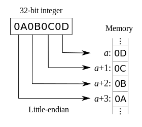

[TOC]

------

## 参考资料

- [More C++ Idioms](https://en.wikibooks.org/wiki/More_C%2B%2B_Idioms)
- [More C++ Idioms 中文翻译](https://github.com/HorkyChen/MoreCPlusPlusIdioms)
- [字节对齐](https://en.wikipedia.org/wiki/Data_structure_alignment)

## 运行时间测量

### C++ 实现方式

> **源码路径：**[calculate_runtime.cpp](https://dudebing99.github.io/blog/archives/cpp_programming/calculate_runtime.cpp)

```cpp
#include <iostream>
#include <chrono>
#include <functional>

using MilliSeconds = std::chrono::milliseconds;
using MicroSeconds = std::chrono::nanoseconds;
using NanoSeconds = std::chrono::nanoseconds;

template<typename TimeT = MilliSeconds>
struct Measure
{
    template<typename F, typename ...Args>
    typename TimeT::rep Execution(F func, Args&&... args)
    {
        auto start = std::chrono::system_clock::now();

        // Now call the function with all the parameters you need.
        func(std::forward<Args>(args)...);

        auto duration = std::chrono::duration_cast< TimeT>
            (std::chrono::system_clock::now() - start);

        return duration.count();
    }
};

class Dummy
{
public:
    Dummy() = default;
    ~Dummy() = default;

public:
    void Add()
    {
        double sum = 0.0;
        for (int i = 0; i < 8000000; ++ i)
        {
            sum += 1.01;
        }
    }
};

void Add()
{
    double sum = 0.0;
    for (int i = 0; i < 8000000; ++i)
    {
        sum += 1.01;
    }
}

int main()
{
    Measure<MilliSeconds> measure;

    std::cout << "1. call directly" << std::endl;
    std::cout << measure.Execution([&]() {
        double sum = 0.0;
        for (int i = 0; i < 8000000; ++i)
        {
            sum += 1.01;
        }
    }) << " ms" << std::endl;

    std::cout << "2. call member function" << std::endl;
    Dummy dummy;
    std::cout << measure.Execution(std::bind(&Dummy::Add, &dummy)) << " ms " << std::endl;

    std::cout << "3. call common function" << std::endl;
    std::cout << measure.Execution(Add) << " ms" << std::endl;

    return 0;
}
```

**输出**

```bash
1. call directly
32 ms
2. call member function
34 ms 
3. call common function
47 ms
```

### C 实现方式

```c
#include <ctime>
#include <stdio.h>

int main()
{
    clock_t begin = clock();

    // your codes
    double sum = 0.0;
    for (int i = 0; i < 100000000; ++ i)
    {
        sum += 1.1;
    }

    clock_t end = clock();

    double elapsed_sec = double(end - begin) / CLOCKS_PER_SEC;
    double elapsed_ms = double(end - begin) / (CLOCKS_PER_SEC / 1000);

    printf("elapsed %.3f second, %.0f ms\n", elapsed_sec, elapsed_ms);

    return 0;
}
```

**输出**

```bash
elapsed 0.360 second, 360 ms
```

## 获取数组长度

```cpp
#include <iostream>
#include <string>

template<typename T>
size_t GetArrayLength1(const T &array)
{
    return sizeof(array) / sizeof(array[0]);
}

template<typename T, size_t N>
size_t GetArrayLength2(const T(&)[N])
{
    return N;
}

int main()
{
    int array[] = { 1, 3, 4, 5, 7 };
    std::cout << "Length: " << GetArrayLength1(array) << std::endl;
    std::cout << "Length: " << GetArrayLength2(array) << std::endl;

    return 0;
}
```

**输出**

```bash
Length: 5
Length: 5
```

## 字节对齐

> **详细内容请参考：**[字节对齐与填充规则](https://en.wikipedia.org/wiki/Data_structure_alignment)
>
> **备注：**根据实际情况打开（存取速度优先）、关闭（节省内存空间）字节对齐。

**目的：**为了加快 CPU 访问数据的速度，将数据在内存中按照一定规律做字节对齐。

**简单描述对齐与填充机制：**

- 每个成员变量的首地址，必须是它的类型的对齐值的整数倍，如果不满足，它与前一个成员变量之间要填充（padding）一些无意义的字节来满足
- 整个结构体的大小，必须是该结构体中所有成员的类型中对齐值最大者的整数倍，如果不满足，在最后一个成员后面填充一些无意义的字节来满足

**更改 C 编译器的缺省字节对齐方式** 

​	在缺省情况下，C 编译器为每一个变量或是数据单元按其自然对齐条件分配空间。一般地，可以通过下面的方法来改变缺省的对齐条件：

- 使用伪指令 #pragma pack (n)，C 编译器将按照 n 个字节对齐；使用伪指令 #pragma pack ()，取消自定义字节对齐方式
-  __attribute((aligned (n)))，让所作用的结构成员对齐在 n 字节自然边界上。如果结构中有成员的长度大于 n，则按照最大成员的长度来对齐
- \__attribute__ ((packed))，取消结构在编译过程中的优化对齐，按照实际占用字节数进行对齐

**举例**

- 缺省字节对齐方式

```c
#include <stdio.h>
#include <string.h>
#include <stdlib.h>

struct Data
{
    char c;
    long val;
    char data[0];
};

int main()
{
    printf("sizeof(Data): %d\n", sizeof(Data));

    return 0;
}
```

**输出**

```bash
sizeof(Data): 16
```

- \__attribute__ ((packed)) 取消优化对齐

```c
#include <stdio.h>
#include <string.h>
#include <stdlib.h>

struct Data
{
    char c;
    long val;
    char data[0];
}__attribute__ ((packed));

int main()
{
    printf("sizeof(Data): %d\n", sizeof(Data));

    return 0;
}
```

**输出**

```bash
sizeof(Data): 9
```

## 大端小端

 

​	对于 32 位的整数，大端机器会在内存的低地址存储高位，在高地址存储低位。



 	小端机器恰好相反，内存的低地址存储低位，在高地址存储高位。

​	大端表示法和人的直观比较相符，从低地址向高地址看过去，就是原先的数；小端表示法更便于计算机的操作，地址增加和个十百千万的增加是一致的。

​	可以通过如下两种方法判断机器属于大端或小端

```cpp
    int32_t i = 0x11223344;

    std::cout << ((*((char *)&i) == 0x11) ? "Big Endian" : "Little Endian") << std::endl;
```

```cpp
union
    {
        int32_t i;
        char c;
    }u;

    u.i = 0x11223344;
    std::cout << ((u.c == 0x11) ? "Big Endian" : "Little Endian") << std::endl;
```

## 变长数组

​	在实际的编程中，我们经常需要使用变长数组，但是 C 语言并不支持变长的数组。此时，我们可以使用结构体的方法实现 C 语言变长数组。

```c
struct Data
{
    char c;
    long val;
    char data[0];
};
```

​	在结构体中，data 是一个数组名；但该数组没有元素；该数组的真实地址紧随结构体 Data 之后，而这个地址就是结构体后面数据的地址。 

```c
#include <stdio.h>
#include <string.h>
#include <stdlib.h>

struct Data
{
    char c;
    long val;
    char data[0];
};

int main()
{
    char str[10] = "123456789";

    Data *data  = (Data*)malloc(sizeof(Data) + sizeof(str));
    data->c     = 'a';
    data->val   = 99;
    memcpy(data->data, str, strlen(str));

    printf("sizeof(Data): %d\n", sizeof(Data));
    printf("sizeof(*data): %d\n", sizeof(*data));

    printf("c: %c, val: %d, data: %s\n", data->c, data->val, data->data);

    free(data);

    return 0;
}
```

**输出**

> 运行环境 x64 机器，默认开启字节对齐，示例中结构体按照 8 字节对齐，所以三个成员变量分别占用 8、8、0 字节，合计 16 字节。

```bash
sizeof(Data): 16
sizeof(*data): 16
c: a, val: 99, data: 123456789
```

## 赋值运算符方法优先处理自赋值

​	在实现赋值运算时，需要先判断是否是自赋值。如果赋值运算符操作的两个对象实际是同一个对象，直接返回即可。

```cpp
T& operator= (const T& that)
{
    if (this == &that)
        return *this;

    // handle assignment here

    return *this;
}
```

## PIMPL 指向实现的指针

​	PIMPL（pointer to implementation），即，指向实现的指针，是一种常用的，用来对“类的接口与实现”进行解耦的方法。这个技巧可以避免在头文件中暴露私有细节，因此是促进 API 接口与实现保持完全分离的重要机制。由于PIMPL 解除了接口与实现之间的耦合关系，从而降低文件间的编译依赖关系，PIMPL 也因此常被称为“编译期防火墙“ 。

### 主要优点

- 降低耦合
- 信息隐藏：真正实现依赖于私有指针完成
- 降低编译依赖，提高编译速度：可减少编译冲突
- 接口与实现分离

### 使用场景

​	一般来说，研发部基础平台组负责基础组件的开发，然后提供给业务组使用。因此，基础组件的接口不需要暴露过多的实现细节，同时，实现发生变化时，最好能够做到业务组不需要重新编译所有使用到基础组件的代码，否则将极大地增加学习、使用成本。例如，基础平台组提供跨平台的线程库，最开始只提供 支持 Windows，后续需要支持 Linux；或者需要在类中添加一个私有成员变量，如果直接在接口层实现，将导致 Windows 平台相关的所有代码需要重新编译。此时，利用 PIMPL 即可解决如上问题。

### 示例

​	定义一个 Book 类，包含一个成员变量。

```cpp
class Book
{
public:
    void Print();
private:
    std::string m_contents;
};
```

​	对于使用者而言，只需要关注 Print()，但是如果我们给 Book 类添加一个成员变量

```cpp
class Book
{
public:
    void Print();
private:
    std::string m_contents;
    std::string m_title;
};
```

​	虽然 Print() 接口本身不变，但是使用者需要重新编译所有使用到 Book 类的源码。此时，通过 PIMPL 可以得到解决。

- 提供接口的头文件 public.h

```cpp
// public.h
class Book
{
public:
    void Print();
private:
    class BookImpl;
    BookImpl *m_impl;
};
```

- 私有实现相关的头文件 private.h

```cpp
// private.h
#include "public.h"

class Book::BookImpl
{
public:
    void Print();
private:
    std::string m_contents;
    std::string m_title;
};
```

- 实现源文件

```cpp
Book::Book() : m_impl(new BookImpl())
{
}

Book::~Book()
{
    delete m_impl;
}

void Book::Print()
{
    m_impl->Print();
}

void Book::BookImpl::Print()
{
    std::cout << "print from BookImpl" << std::endl;
}
```

- 对于使用者而言

```cpp
int main()
{
    Book book;
    book.Print();
    
    return 0;
}
```


